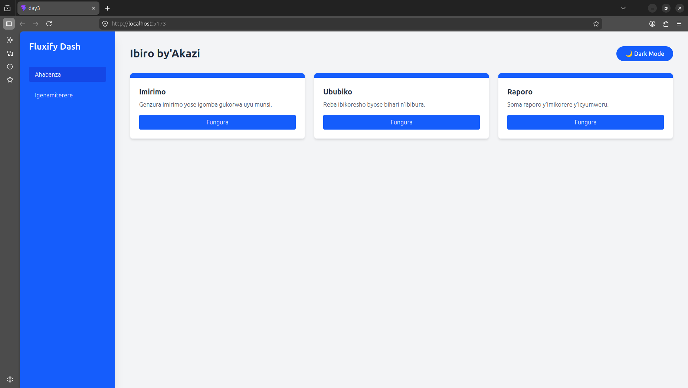
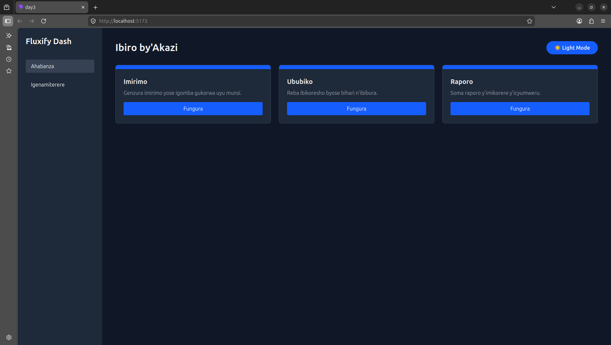

# Week 2 Day 3: Responsive Dashboard & Dark Mode

Uyu ni umushinga w'umunsi wa 3 mu cyumweru cya 2 cy'amahugurwa ya **Fluxify Internship**. Intego yari ugukora Dashboard idahinduka (Responsive) kandi ifite uburyo bwa Dark Mode.

## Ibyakozwe (Features)
1. **Responsive Layout**: 
   - Sidebar igaragara kuri Desktop gusa (hidden on mobile).
   - Card grid ihinduka inkingi 1 kuri mobile ikaba inkingi 3 kuri desktop.
2. **Dark Mode Toggle**: 
   - Hari buto ihindura amabara y'urubuga (Light/Dark).
   - Theme ibikwa muri `localStorage` kugira ngo itazima iyo urefreshinze.
3. **Tailwind CSS v4**: 
   - Twakoresheje version nshya ya Tailwind ifite imikorere yihuta.

## Amafoto y'Umushinga (Screenshots)

### 1. Light Mode

### 2. Dark Mode

## Uko wawukoresha (Setup)
Kugira ngo ufungure uyu mushinga:
1. Manura (Clone) iyi repository.
2. Injira muri folder: `cd week2/day3`.
3. Shyiramo ibikenewe: `npm install`.
4. Fungura: `npm run dev`.